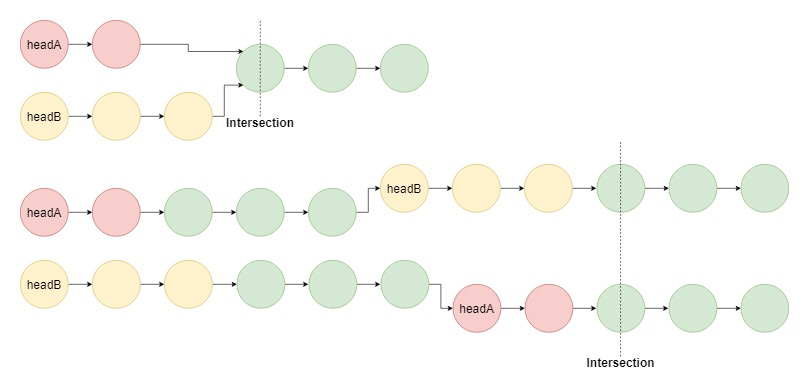
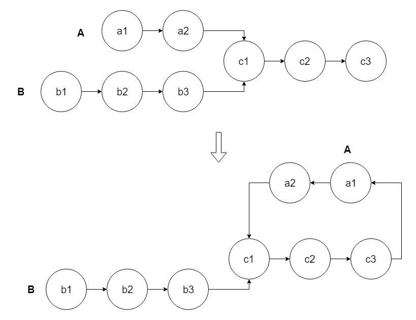

# 160-Intersection of Two Linked Lists.md

[Problem](https://leetcode.com/problems/intersection-of-two-linked-lists/)

## Approach 1: Brute Force

For each node ai in list A, traverse the entire list B and check if any node in list B coincides with ai.

Time complexity: O(mn).

Space complexity: O(1).

```c++
/**
 * Definition for singly-linked list.
 * struct ListNode {
 *     int val;
 *     ListNode *next;
 *     ListNode(int x) : val(x), next(NULL) {}
 * };
 */
class Solution {
public:
    ListNode *getIntersectionNode(ListNode *headA, ListNode *headB) {
        for (auto currA = headA; currA; currA = currA->next) {
            for (auto currB = headB; currB; currB = currB->next) {
                if (currA == currB) {
                    return currB;
                }
            }
        }
        return nullptr;
    }
};
```

## Approach 2: Hash Table

Traverse list A and store the address / reference to each node in a hash set. Then check every node bi in list B: if bi appears in the hash set, then bi is the intersection node.

Time complexity: O(m + n).

Space complexity: O(m + n).

```c++
class Solution {
public:
    ListNode *getIntersectionNode(ListNode *headA, ListNode *headB) {
        unordered_set<ListNode*> s;
        for (auto currA = headA; currA; currA = currA->next) {
            s.insert(currA);
        }

        for (auto currB = headB; currB; currB = currB->next) {
            if (s.find(currB) != s.end()) {
                return currB;
            }
        }
        return nullptr;
    }
};
```

## Approach 3: Two Pointers—Crossover Loop

Maintain two pointers pA and pB initialized at the head of A and B, respectively. Then let them both traverse through the lists, one node at a time. When pA reaches the end of a list, then redirect it to the head of B; similarly when pBpB reaches the end of a list, redirect it the head of A. If at any point pA meets pB, then pA/pB is the intersection node.

The trick of this crossover loop is to ensure that the two pointers arrive at the intersection node (if have) the second time at the same time. If the two lists have no intersection, then the last nodes of them do not coincide.

Time complexity: O(m + n).

Space complexity: O(1).



```c++
class Solution {
public:
    ListNode *getIntersectionNode(ListNode *headA, ListNode *headB) {
        ListNode *pA = headA, *pB = headB;

        while (pA || pB) {
            if (pA == pB) return pA;  
            pA = pA ? pA->next : headB;
            pB = pB ? pB->next : headA;
        }

        return nullptr;
    }
};
```

## Approach 4: Two Pointers—Cycle Detection

The solution is inspired by 142. Linked List Cycle II. First connect tailA to headA to form a cycle. If the two lists have intersection, then we have created a new linked list that has headB as its head and contains a cycle. Now, the problem is converted to 142. Linked List Cycle II, and we do cycle detection. The intersection node is exactly the node where the cycle begins. Note that we need to restore the linked structure in the end.

Time complexity: O(m + n).

Space complexity: O(1).



```c++
class Solution {
public:
    ListNode *getIntersectionNode(ListNode *headA, ListNode *headB) {
        ListNode* intersect = nullptr;

        // Connect tail to headA
        ListNode* tailA = nullptr;
        for (auto curr = headA; curr; curr = curr->next) {
            tailA = curr;
        }
        if (tailA) tailA->next = headA;

        // Detect cycle, start from headB
        ListNode* slow = headB;
        ListNode* fast = headB;

        while (fast && fast->next) {
            slow = slow->next;
            fast = fast->next->next;

            if (slow == fast) {
                slow = headB;
                while (slow != fast) {
                    slow = slow->next;
                    fast = fast->next;
                }
                intersect = slow;
                break;
            }
        }

        // Restore linked structure
        if (tailA) tailA->next = nullptr;

        return intersect;
    }
};
```
