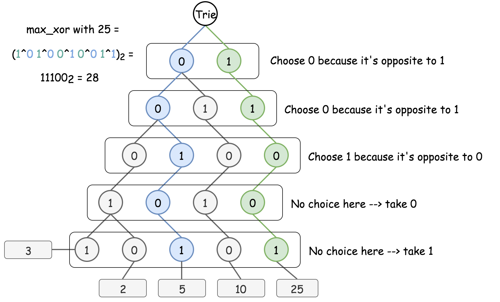

# 421-Maximum XOR of Two Numbers in an Array

[Problem](https://leetcode.com/problems/maximum-xor-of-two-numbers-in-an-array/)

## Approach 1: Bitwise Trie

Use Bitwise Trie (a special trie where the alphabet is simply {0, 1}) to store binary prefixes in an efficient way. To maximize XOR, the strategy is to choose the opposite bit at each step whenever it's possible.



Time complexity: O(n). It takes O(L) to insert a number in Trie, and O(L) to find the max XOR of the given number with all already inserted one, where L is the length of max number in a binary representation and is considered as a constant.

Space complexity: O(1) extra space, since one needs O(2^L) space to keep Trie, which is considered constant.

```c++
class TrieNode {
public:
    TrieNode(int alphabet_size) {
        children = vector<TrieNode*>(alphabet_size);
    }

    ~TrieNode() {
        for (auto child : children)
            delete child;
    }

    vector<TrieNode*> children;
};

class BitwiseTrie {
public:
    BitwiseTrie() {
        root = new TrieNode(2);
    }

    ~BitwiseTrie() {
        delete root;
    }

    void insert(const vector<int>& binaryNum) {
        TrieNode* node = root;
        for (int bit : binaryNum) {
            if (!node->children[bit]) {
                node->children[bit] = new TrieNode(2);
            }
            node = node->children[bit];
        }
    }

    int maxXOR(const vector<int>& binaryNum) {
        TrieNode* xorNode = root;
        int maxXOR = 0;
        for (int bit : binaryNum) {
            int toggledBit = 1 - bit;
            if (xorNode->children[toggledBit]) {
                maxXOR = (maxXOR << 1) | 1;
                xorNode = xorNode->children[toggledBit];
            } else {
                maxXOR = maxXOR << 1;
                xorNode = xorNode->children[bit];
            }
        }
        return maxXOR;
    }

private:
    TrieNode* root;
};

vector<int> toBinary(int n, int L) {
    vector<int> res(L, 0);

    int i = L - 1;
    while (n > 0) {
        res[i--] = n % 2;
        n /= 2;
    }

    return res;
}

class Solution {
public:
    int findMaximumXOR(vector<int>& nums) {
        int maxNum = *max_element(nums.begin(), nums.end());
        if (maxNum == 0)
            return 0;

        // find the length L of max number in a binary representation
        int L = 0;
        while (maxNum > 0) {
            maxNum = maxNum >> 1;
            L++;
        }

        BitwiseTrie trie;
        int maxXOR = 0;
        for (int num : nums) {
            // convert num to binary representation
            vector<int> binaryNum = toBinary(num, L);
            // build bitwise trie
            trie.insert(binaryNum);
            // compute max xor for already inserted numbers
            maxXOR = max(maxXOR, trie.maxXOR(binaryNum));
        }

        return maxXOR;
    }
};
```
