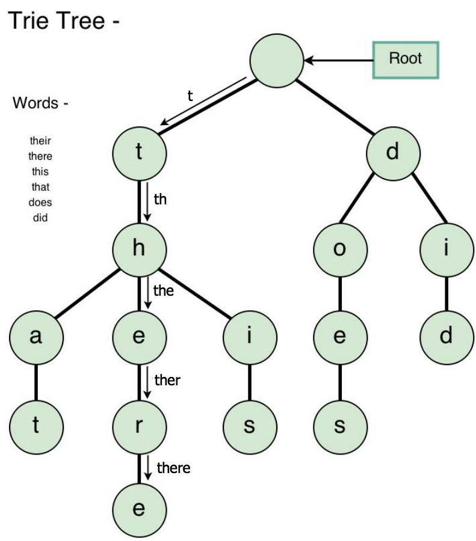

# Trie (Prefix Tree)

A trie (prefix tree), is a kind of search tree—an ordered tree data structure used to store a dynamic set or associative array where the keys are usually strings. Unlike a binary search tree, no node in the tree stores the key associated with that node; instead, its position in the tree defines the key with which it is associated; i.e., the value of the key is distributed across the structure. All the descendants of a node have a common prefix of the string associated with that node, and the root is associated with the empty string.



```c++
class TrieNode {
public:
    TrieNode() : word_end(false) {
        children = vector<TrieNode*>(alphabet_size);
    }

    ~TrieNode() {
        for (auto child : children)
            delete child;
    }

    TrieNode* get(char ch) {
        return children[ch - 'a'];
    }

    void put(char ch, TrieNode* node) {
        children[ch - 'a'] = node;
    }

    bool isEnd() {
        return word_end;
    }

    void setEnd() {
        word_end = true;
    }
private:
    static constexpr int alphabet_size = 26;
    vector<TrieNode*> children;
    bool word_end;
};

class Trie {
public:
    /** Initialize your data structure here. */
    Trie() {
        root = new TrieNode{};
    }

    ~Trie() {
        delete root;
    }

    /** Inserts a word into the trie. */
    void insert(string word) {
        TrieNode* curr = root;
        for (auto ch : word) {
            if (!curr->get(ch)) {
                curr->put(ch, new TrieNode{});
            }
            curr = curr->get(ch);
        }
        curr->setEnd();
    }

    /** Returns if the word is in the trie. */
    bool search(string word) {
        if (word.empty())
            return true;

        TrieNode* curr = root;
        for (auto ch : word) {
            curr = curr->get(ch);
            if (!curr) return false;
        }
        return curr->isEnd();
    }

    /** Returns if there is any word in the trie that starts with the given prefix. */
    bool startsWith(string prefix) {
        TrieNode* curr = root;
        for (auto ch : prefix) {
            curr = curr->get(ch);
            if (!curr) return false;
        }
        return true;
    }
private:
    TrieNode* root;
};

/**
 * Your Trie object will be instantiated and called as such:
 * Trie* obj = new Trie();
 * obj->insert(word);
 * bool param_2 = obj->search(word);
 * bool param_3 = obj->startsWith(prefix);
 */
```
